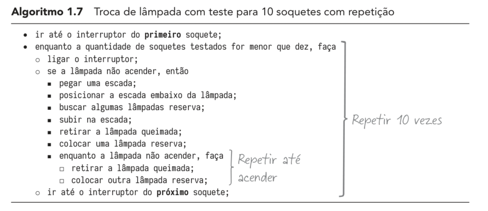
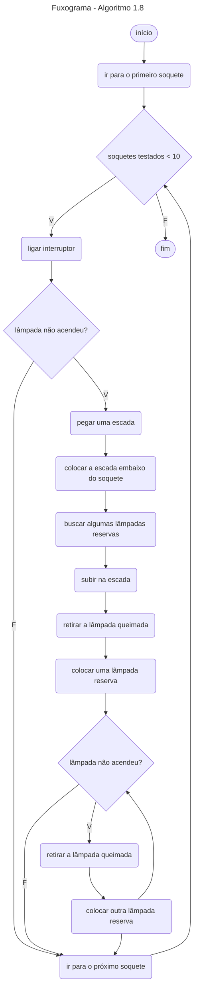
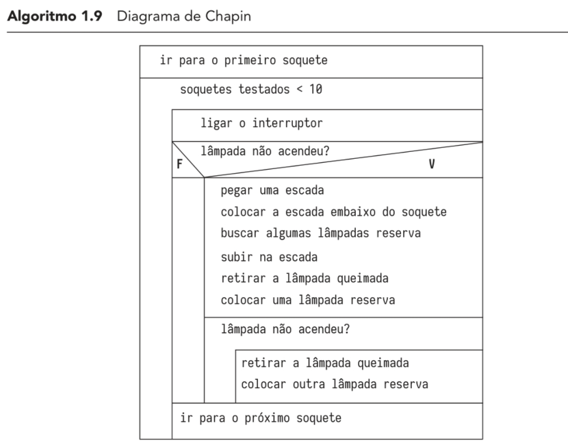
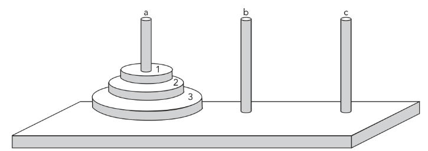

# Lógica de Programação

## Livro 01: 
> Logica de Programação: a construção de algoritmos e estrutura de dados com aplicações em Python - 4ª edição
> André Luiz Villar Forbellone | Henri Frederico Eberspacher

### Capítulo 01 - Introdução à Lógica de Programação

Lógica estuda e ensina a colocar 'ordem no pensamento', é o uso correto das leis do pensamento.

**Algoritmo**
O objetivo principal do estudo da LP é a construção de algoritmos coerentes e válidos, pode ser definido com uma sequência de passos com objtivo de atingir o resultado.

Um algoritmo é uma linha de raciocício, que pode ser descrito de diversas maneiras, de forma gráfica ou textual. 

- 1. Textutal
- 2. Fluxograma
- 3. Diagrama de Chapin

________

__________

  

____

#### Exercícios de fixação 01

1. Um homem precisa atravessar um rio com um barco que possui capacidade apenas para carregar ele mesmo e mais uma de suas três cargas, que são: um lobo, um bode e um maço de alfafa. O que o homem deve fazer para conseguir atravessar o rio sem perder suas cargas? Escreva um algoritmo mostrando a resposta, ou seja, indicando todas as ações necessárias para efetuar uma travessia segura.

Nome: Carga para outra ilha
- A: Selecionar: Bode
- B: (A) Subir no Barco| Ir para a Ilha 02 | Descer do barco;
- C: Retornar para a ilha 01 e manter o item selecionado na ilha
- A: Selecionar: Maço de Alfafa
- B: (A) Subir no Barco| Ir para a Ilha 02 | Descer do barco;
- A: Selecionar: Bode
- D: (A) Subir no Barco| Ir para a Ilha 01 | Descer do barco;
- A: Selecionar: Lobo
- B: (A) Subir no Barco| Ir para a Ilha 02 | Descer do barco;
- C: Retornar para a ilha 0
- A: Selecionar: Bode
- B: (A) Subir no Barco| Ir para a Ilha 02 | Descer do barco;
- E: Fim

2. Elabore um algoritmo que mova três discos de uma Torre de Hanói, que consiste em três hastes (a – b – c), uma das quais serve de suporte para três discos de tamanhos diferentes (1 – 2 – 3), os menores sobre os maiores. Pode-se mover um disco de cada vez para qualquer haste, contanto que nunca seja colocado um disco maior sobre um menor.

O objetivo é transferir os três discos para outra haste.

Nome: Haste `a` para haste `b`

- 1.b
- 2.c
- 1.c
- 3.b
- 1.a
- 2.b
- 1.b

3. Três jesuítas e três canibais precisam atravessar um rio; para tal, dispõem de um barco com capacidade para duas pessoas. Por medida de segurança, não se deve permitir que em alguma margem a quantidade de jesuítas seja inferior à de canibais. Qual a solução para efetuar a travessia com segurança? Elabore um algoritmo mostrando a resposta, indicando as ações que concretizam a solução desse problema.

Nome: Jesuítas e Canibais

- Atravesar dois Canibais para a margem B
- Retornar para a margem A, com o barco vazio
- Atravesar doi Jesuítas para a margem B
- Retornar para a margem A, com o barco vazio
- Atravesar o restante da margem A: 1 Canibal e 1 Jesuíta para a margem B
- Fim

> A lógica não está no computador... a lógica está no Programador!

**Codificação:** processo de expressar um algoritmo usando linguagem de programação.

**Programa de Computador:** o resultado da codificação de um algoritmo em uma linguagem computacional 